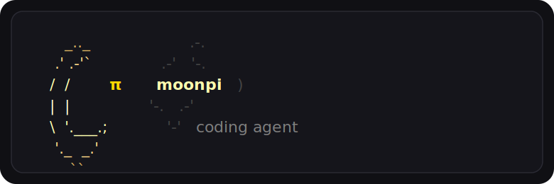

<p align="center">
  
</p>
<p align="center"><em>opinionated set of extensions for pi</em></p>

---

**moonpi** is set of extensions for [pi](https://github.com/badlogic/pi-mono/tree/main/packages/coding-agent) **that are actually useful** for a coding agent.
No fluff. No over-engineered architecture. Just practical guardrails, structured workflows, and pragmatism.

---

## Opinions

moonpi is built around a few **strong opinions**.

If these **resonate** with you, you might **find** this set of extensions **useful**:

- **Subagents are a waste of tokens.**  
  Subagents are useless and just a conspiracy to make us use more tokens.  
  *Tin foil hat firmly on.*

- **Plan mode is actually useful — but only if history is retained.**  
  Plan mode becomes pointless when the model outputs a “plan” and then loses all the context that produced it.  
  Planning only works when the planning conversation remains part of the execution context.

- **Rejecting reads and writes outside the working directory is good steering.**  
  Yes, we all know the model can write and execute code, and yes, sandboxing is hard.  
  But telling the model “hey, you cannot read that” when it reaches outside the project helps steer behavior.  
  May our benevolent AI overlords accept this humble suggestion.

- **Read before write is mandatory.**  
  If a model tries to overwrite a file without reading it first, that is an error.  
  It should not be allowed. Period.

- **Loops are stupidly simple.**  
  A specification file, a TODO list, and auto-compaction after every phase are more than enough for most use cases.

## Installation

First, install the base `pi` coding agent globally:

```bash
npm install -g @mariozechner/pi-coding-agent
```

Then, install the `moonpi` extension set directly via `pi`:

```bash
pi install git:github.com/galatolofederico/moonpi@v0.1
```


## Features

moonpi adds a practical workflow layer on top of `pi`, focused on:

- explicit work modes
- persistent planning context
- TODO-driven execution
- safer file access behavior
- automatic project documentation context
- sprint-based long-running workflows
- phase-by-phase execution loops


## Modes

moonpi provides four modes (Auto Mode has two phases):

| Mode | Available Tools | Description |
| --- | --- | --- |
| **Plan Mode** | `read`, `grep`, `find`, `ls`, `todo`, `question` | Used to reason about the task before making changes. The model must produce a TODO list. No file modifications or shell commands are allowed. |
| **Act Mode** | `read`, `grep`, `find`, `ls`, `bash`, `edit`, `write`, `todo`, `question` (+ `end_phase` in sprint loop) | Used to execute work. The model can read, write, edit, and run commands. TODO and QnA can be used when helpful, but are not mandatory. |
| **Auto Mode** (Plan phase) | `read`, `grep`, `find`, `ls`, `todo`, `question`, `end_conversation` | Default mode. The model first plans, then acts while retaining the full planning conversation history. During the planning phase, an `end_conversation` tool is available for question-only requests that do not need a TODO list. |
| **Auto Mode** (Act phase) | `read`, `grep`, `find`, `ls`, `bash`, `edit`, `write`, `todo`, `question` (+ `end_phase` in sprint loop) | After planning, the model executes the TODO list with full planning context intact. |
| **Fast Mode** | `read`, `grep`, `find`, `ls`, `bash`, `edit`, `write` (+ `end_phase` in sprint loop) | Direct execution mode. No planning requirement, no TODO list, no QnA. Useful for quick edits and simple tasks. |

Modes can be cycled using `Tab`

Each mode has a different textbox color in the UI, making the current workflow state immediately visible.

## Auto Mode

**Auto Mode** is the default moonpi workflow.

It works in two phases:

1. **Plan phase**
   - editing tools are disabled
   - the TODO list tool is enabled
   - the model plans the work
   - the model either:
     - produces a TODO list, then continues to Act Mode
     - or calls `end_conversation` when the user is only asking a question

2. **Act phase**
   - editing tools become available
   - the conversation history from the Plan phase is retained
   - the model executes the TODO list with full planning context intact

This avoids the “plan then forget everything” problem.

## TODO List Tool

moonpi includes a TODO list tool that can be updated at any moment.

Whenever an item is modified, the current full state of the TODO list is returned to the model.

This keeps the agent grounded in the actual progress of the task instead of relying on vibes, memory, or whatever it hallucinated three messages ago.

## Project Context Injection

moonpi automatically injects project documentation into the model context.

If the project contains:

- `README.md`
- `SPECS.md`
- `SPRINT.md`

moonpi recursively discovers and injects them into context. At startup, a notification shows which files were found and injected, so you always know what context the model has access to.

This behavior can be disabled or configured in `/moonpi:settings`.

The system prompt also instructs the model to keep these files up to date, making `README.md` and `SPECS.md` living project documents instead of abandoned archaeology.


## Filesystem Guardrails

moonpi adds practical file access rules.

### Stay inside the working directory

Reads, writes, and edits outside the current working directory are rejected.

This is not presented as magical security theater. It is a behavioral constraint that helps steer the model toward project-scoped work.

### Read before write

moonpi requires the model to read a file before writing to it.

If the model tries to write to a file without reading it first, the write tool returns an error.

This prevents careless overwrites and forces the agent to inspect the current state of a file before modifying it.

## Moonpi loop

moonpi includes sprint-oriented loop for larger projects.

### `/sprint:init`

Creates a new sprint for a larger project.

This command asks **one question**: the sprint objective.

It then delegates SPRINT.md and TASKS.md creation to the agent, which writes:

```txt
./sprints/<sprint_number>/SPRINT.md
./sprints/<sprint_number>/TASKS.md
```

The sprint is divided into phases.

Each phase includes tasks and verification steps that define when the phase is complete.

The goal is to turn a vague big project into a concrete, phased execution plan.

### `/sprint:loop`

Runs the latest sprint phase-by-phase. Automatically picks the most recent sprint.

The loop works like this:

1. complete one phase
2. mark completed tasks in:

```txt
./sprints/<sprint_number>/TASKS.md
```

3. compact the conversation/context
4. proceed to the next phase
5. repeat until the sprint is complete

The model signals the end of a phase by calling a special `end_phase` tool.

This keeps long-running projects simple, resumable, and grounded in actual files.

### Does it work?

Watch a drastically sped-up video of `Qwen/Qwen3.6-27B` working unattended for over an hour on this sprint prompt:

```text
create WebOS a fully functional web-based operating system with apps, games and everything
```

https://github.com/user-attachments/assets/a2fae456-b5e5-49e3-ad62-732004435563

And judge the result yourself [here](https://qwen36-27b-moonpi-webos.netlify.app/).

## Custom Providers

moonpi includes the support from some custom providers.


### Synthetic Provider

Moonpi registers Synthetic as the `synthetic` provider using the OpenAI-compatible endpoint.

Configure credentials with either:

```bash
export SYNTHETIC_API_KEY=...
```

or run:

```text
/login
```

Use `/model` to select a `synthetic` model. Use `/synthetic:quotas` to show the current Synthetic subscription and usage quotas.


## Why moonpi?

moonpi is not trying to be a giant agent framework.

It does not try to invent a new architecture for every task.

It does not summon a committee of subagents to discuss whether a file should be edited.

It gives the coding agent a simple structure:

* plan when needed
* act when needed
* keep the plan in context
* track work explicitly
* stay inside the project
* read before writing
* compact after meaningful phases
* keep project docs alive

That is usually enough.

And when it is not enough, it is still better than burning tokens on fake organizational charts for imaginary agents.


> **Fun Fact:** I used `moonpi` to build `moonpi`, making it a bootstrapped coding agent.

## License

MIT
